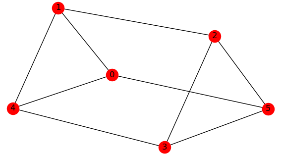
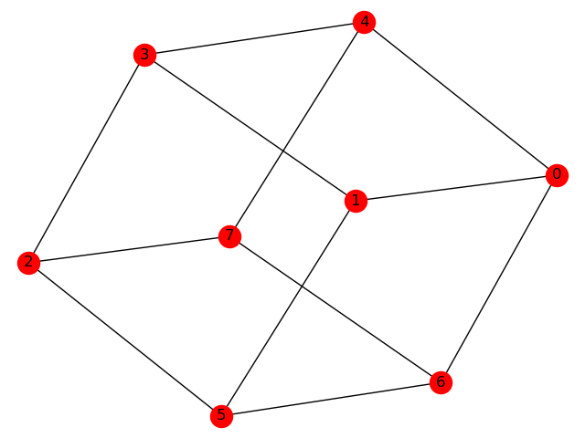
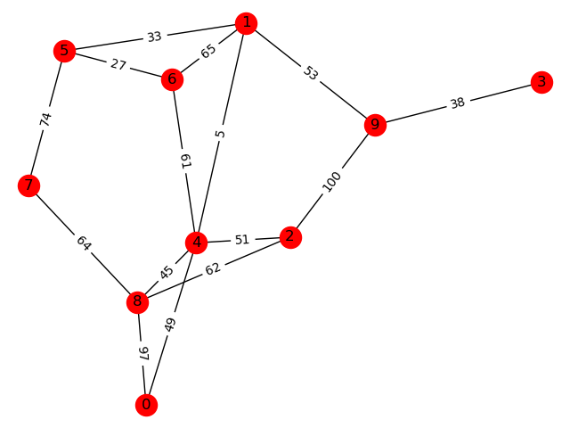

# random-graph-generator
A python utility to generate random graph as edge list for graph algorithm exercises.

[](https://github.com/DAVFoundation/captain-n3m0/blob/master/LICENSE)

## Dependencies
Require Python3 and [NetworkX](https://networkx.org).

Tested with python 3.7 and networkx 2.2.

## Usage
Command: `gen_graph.py`

| Generate Graph Types | Arguments |
| :--------- | :------ |
| Random undirected graph with `n` nodes and `m` edges | `-grnm -n <n> -m <m>` |
| Random undirected graph with `n` nodes and `d` degree | `-grnd -n <n> -d <d>` |
| Random undirected graph with `n` nodes and `p` edge creation probability | `-grnp -n <n> -p <p>` |
| Complete graph with `n` nodes | `-gkn -n <n>` |
| Cycle graph with `n` nodes | `-gcn -n <n>` |
| Path graph with `n` nodes | `-gpn -n <n>` |
| Random tree graph with `n` nodes | `-trn -n <n>` |
| Full `c`-ary tree with `h` height | `-tch -c <c> -h <h>` |
| Full `c`-ary tree with `n` nodes | `-tcn -c <c> -n <n>` |

| More Options | Arguments |
| :--------- | :---- |
| Show help messages | `--help` |
| Add `int` edge weights in range `[0, 100]` | `-w int` |
| Add `int` edge weights in range `[a, b]` | `-w int -wmin <a> -wmax <b>` |
| Add `float` edge weights in range `[a, b]` | `-w float -wmin <a> -wmax <b>` |
| Generate directed graph | `--dir` |
| Use 1-indexed | `--one-based` |
| Use random seed | `--seed <N>` |
| Visualize graph with pyplot | `--visualize` |
| Output to a file instead of stdout | `--output <filename>` |

### Output Format
The first line shows the total number of nodes and edges:
```
<num-nodes> <num-edges>
```
The rest of lines show one edge per line with from/to nodes (0-indexed by default) and weight (if enabled): 
```
<from-node1> <to-node1> [weight1]
<from-node2> <to-node2> [weight2]
<from-node3> <to-node3> [weight3]
...
```

## Examples
### Graph with Fixed Degree
```
$ gen_graph.py -grnd -n 6 -d 3 --seed 0 --vis
6 9
0 1
0 5
0 4
1 2
1 4
2 3
2 5
4 3
5 3
```


```
$ gen_graph.py -grnd -n 8 -d 3 --seed 34 --vis
8 12
2 7
2 3
2 5
7 4
7 6
0 1
0 6
0 4
1 3
1 5
4 3
6 5
```


### Graph with Weighted Edges
```
$ gen_graph.py -grnm -n 10 -m 15 -w int --seed 0 --vis
10 15
0 4 49
0 8 97
1 9 53
1 4 5
1 5 33
1 6 65
2 8 62
2 4 51
2 9 100
3 9 38
4 6 61
4 8 45
5 7 74
5 6 27
7 8 64
```


