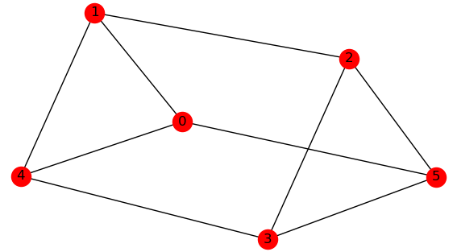

# random-graph-generator
A python utility based on networkx to generate random graphs as edge lists

[](https://github.com/DAVFoundation/captain-n3m0/blob/master/LICENSE)

## Dependencies
Tested with python 3.7 and networkx 2.2

## Usage

### Help Information
```
$ gen_graph.py --help
usage: gen_graph.py [--help]
                    (-grnm | -grnd | -grnp | -gkn | -gcn | -gpn | -trn | -tch | -tcn)
                    [-n node] [-m edge] [-d degree] [-p probability]
                    [-h height] [-c children] [--directed] [--one-based]
                    [--seed N] [--visualize] [--output FILE]

optional arguments:
  --help          show this help message and exit
  -grnm           random graph with n nodes and m edges
  -grnd           random graph with n nodes and d degree of each node
  -grnp           random graph with n nodes and p edge creation probability
  -gkn            complete graph of n nodes
  -gcn            cycle graph of n cyclically connected nodes
  -gpn            path graph of n linearly connected nodes
  -trn            random tree with n nodes
  -tch            full c-ary tree with h height
  -tcn            full c-ary tree with n nodes
  -n node         number of nodes
  -m edge         number of edges
  -d degree       degree of nodes in a graph
  -p probability  edge creation probability
  -h height       tree height
  -c children     number of children in a tree
  --directed      generate directed graph
  --one-based     output edges using one-based node ids
  --seed N        random seed
  --visualize     visualize generated graph using pyplot
  --output FILE   output generated graph as an edge list to a file
```

### Generate Graphs

Random undirected graph with `n` nodes and `m` edges:
```
$ gen_graph.py -grnm -n <n> -m <m>
```
Random undirected graph with `n` nodes and `d` degree:
```
$ gen_graph.py -grnd -n <n> -d <d>
```
Random undirected graph with `n` nodes and `p` edge creation probability:
```
$ gen_graph.py -grnp -n <n> -p <p>
```
Random directed graph with `n` nodes and `m` edges:
```
$ gen_graph.py -grnm -n <n> -m <m> --dir
```
Complete graph with `n` nodes:
```
$ gen_graph.py -gkn -n <n>
```
Cycle graph with `n` nodes:
```
$ gen_graph.py -gcn -n <n>
```
Path graph with `n` nodes:
```
$ gen_graph.py -gpn -n <n>
```

### Generate Trees
Random tree with `n` nodes:
```
$ gen_graph.py -trn -n <n>
```
Full `c`-ary tree with `h` height:
```
$ gen_graph.py -tch -c <c> -h <h>
```
Full `c`-ary tree with `n` nodes:
```
$ gen_graph.py -tcn -c <c> -n <n>
```

### Output Format
Output to stdout:
```
$ gen_graph.py -gpn -n 4
```
```
4 3
0 1
1 2
2 3
```
Output to stdout with 1-based node indices:
```
$ gen_graph.py -gpn -n 4 --one
```
```
4 3
1 2
2 3
3 4
```
Output to a file:
```
$ gen_graph.py -gpn -n 4 --out g.txt
```
Visualize with pyplot:
```
$ gen_graph.py -grnd -n 6 -d 3 --seed 0 --vis
```

```
6 9
0 1
0 5
0 4
1 2
1 4
2 3
2 5
4 3
5 3
```
